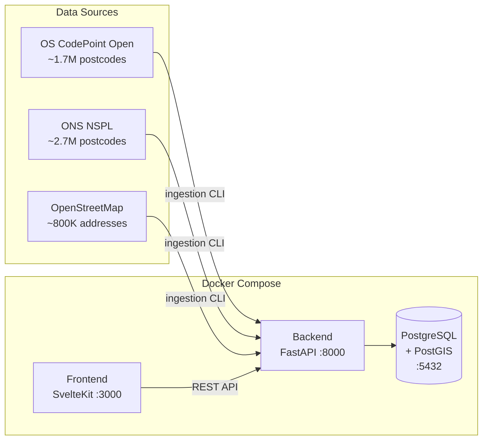

# UK Postcode & Address Lookup

Full-stack application for looking up UK postcodes and their associated addresses. Ingests data from three open sources (OS CodePoint Open, ONS NSPL, OpenStreetMap), stores it in PostgreSQL/PostGIS, and serves it via a REST API with a SvelteKit frontend.

## Architecture



- **Frontend** — SvelteKit 5 SPA with Tailwind CSS. Postcode autocomplete, address lookup.
- **Backend** — Python/FastAPI. Ingestion CLI + REST API. 5 endpoints.
- **Database** — PostGIS. ~2.7M postcodes, ~800K addresses.

## Quick Start

### Prerequisites

- Docker & Docker Compose
- [uv](https://docs.astral.sh/uv/) (Python package manager)
- Node.js 22+

### 1. Start the database

```sh
make db
```

### 2. Set up the backend

```sh
cp .env.example .env
make install
make init        # Create tables
make download    # Download source data (~1.2 GB)
make ingest      # Parse and load into database
```

### 3. Start the API

```sh
make serve       # Backend at http://localhost:8000
```

### 4. Start the frontend

```sh
make fe-install
make fe-dev      # Frontend at http://localhost:5173
```

### Docker Compose (all services)

```sh
docker compose up
```

This starts PostgreSQL (:5432), the backend API (:8000), and the frontend (:3000).

## Project Structure

```
├── backend/             # Python — FastAPI + ingestion CLI
│   ├── app/
│   │   ├── core/        # Config, database, utilities
│   │   ├── ingestion/   # CLI, parsers, loaders
│   │   └── api/         # FastAPI routes and schemas
│   ├── data/            # Downloaded source files (gitignored)
│   └── tests/
├── frontend/            # SvelteKit SPA
│   └── src/
│       ├── lib/         # API client, components
│       └── routes/      # Single-page app
├── docker-compose.yml
├── Makefile             # Run `make` to see all targets
└── .env.example
```

## API Endpoints

| Method | Path | Description |
|--------|------|-------------|
| GET | `/health` | Health check with record counts |
| GET | `/postcodes/autocomplete?q=SW1A` | Postcode prefix search |
| GET | `/postcodes/{postcode}` | Postcode lookup with all addresses |
| GET | `/addresses/search?q=downing` | Full-text address search |
| GET | `/addresses/{id}` | Single address by ID |

## Data Sources

| Source | Records | Description |
|--------|---------|-------------|
| [OS CodePoint Open](https://www.ordnancesurvey.co.uk/products/code-point-open) | ~1.7M | Postcode centroids with coordinates |
| [ONS NSPL](https://geoportal.statistics.gov.uk/) | ~2.7M | National Statistics Postcode Lookup (all postcodes incl. terminated) |
| [OpenStreetMap](https://download.geofabrik.de/) | ~800K | Building addresses extracted from Great Britain PBF |

## Make Targets

Run `make` with no arguments to see all available targets:

```sh
make
```

## Tech Stack

| Layer | Technology |
|-------|------------|
| Frontend | SvelteKit 5, Svelte 5 (runes), Tailwind CSS v4, TypeScript |
| Backend | Python 3.12, FastAPI, SQLAlchemy 2, Typer |
| Database | PostgreSQL 16, PostGIS 3.4 |
| Tooling | uv, Docker Compose, Ruff, Prettier, ESLint |
